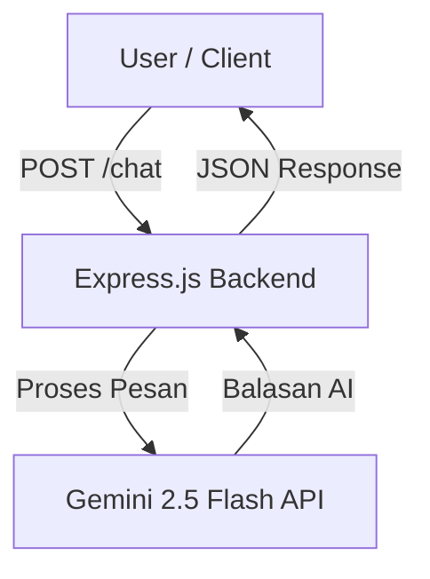

# 💬 Gemini Chatbot — Fast & Smart with Gemini Flash API


> 🚀 **Gemini Chatbot** adalah aplikasi chatbot sederhana dan cepat menggunakan **Gemini 2.5 Flash API** dengan backend **Express.js**  frontend **Vanila.JS** dan dukungan **CORS** untuk akses lintas domain.  
> Cocok untuk integrasi ke aplikasi web, mobile, atau sistem internal Anda.

---

## ✨ Fitur Utama

- ⚡ **Respons Cepat** — Menggunakan Gemini Flash API untuk single-turn conversation.
- 🌐 **CORS Support** — Aman digunakan lintas domain.
- 🛠 **Mudah Dikustomisasi** — API endpoint sederhana & fleksibel.
- 🔐 **Keamanan API Key** — Menggunakan `.env` untuk menyimpan API Key secara aman.
- 📦 **Ringan & Minimalis** — Hanya memerlukan Express dan CORS.

---

## 📂 Struktur Proyek

```
gemini-chatbot/
├── package.json
├── index.js
├── .env
├── README.md
├── public/
│   └── index.html
    └── style.css
    └── script.js
└── node_modules/
```

---

## ⚙️ Instalasi

1. **Clone repositori**
   ```bash
   git clone https://github.com/username/ekagemini-chatbot-api.git
   cd ekagemini-chatbot-api
   ```

2. **Install dependensi**
   ```bash
   npm install express cors dotenv @google/genai
   ```

3. **Buat file `.env`**
   ```env
   GEMINI_API_KEY=masukkan_api_key_anda_disini
   ```

4. **Jalankan server**
   ```bash
   node --watch index.js
   ```
   Server akan berjalan di: `http://localhost:3000`

---

## 🖥 Kode Lengkap (`index.js`) // file ini berbeda dengan yang ada di dalam repo (pakai yang di repo hehe)
```javascript
import express from 'express';
import cors from 'cors';
import dotenv from 'dotenv';
import { GoogleGenerativeAI } from '@google/genai';

dotenv.config();
const app = express();
app.use(cors());
app.use(express.json());

const genAI = new GoogleGenerativeAI(process.env.GEMINI_API_KEY);

app.post('/chat', async (req, res) => {
  try {
    const { message } = req.body;
    if (!message) return res.status(400).json({ error: 'Message is required' });

    const model = genAI.getGenerativeModel({ model: 'gemini-1.5-flash' });
    const result = await model.generateContent(message);

    res.json({ reply: result.response.text() });
  } catch (error) {
    console.error(error);
    res.status(500).json({ error: 'Something went wrong' });
  }
});

app.listen(3000, () => console.log('🚀 Server running on port 3000'));
```

---

## 📡 Contoh Request dari Frontend

```javascript
async function sendMessage() {
  const res = await fetch('http://localhost:3000/chat', {
    method: 'POST',
    headers: { 'Content-Type': 'application/json' },
    body: JSON.stringify({ message: 'Hello, Gemini!' })
  });
  const data = await res.json();
  console.log('Gemini:', data.reply);
}
```

---

## 🗺 Diagram Arsitektur



---

## 🔒 Keamanan

- Simpan API key di `.env` dan **jangan** commit file tersebut ke GitHub.
- Aktifkan pembatasan penggunaan API di Google Cloud Console.

---

## 📜 Lisensi

Proyek ini dilisensikan di bawah [MIT License](LICENSE).

---

> 💡 **Tips:** Anda bisa mengembangkan chatbot ini menjadi aplikasi web interaktif dengan React, Vue, atau Svelte, lalu hubungkan langsung ke endpoint `/chat`.
